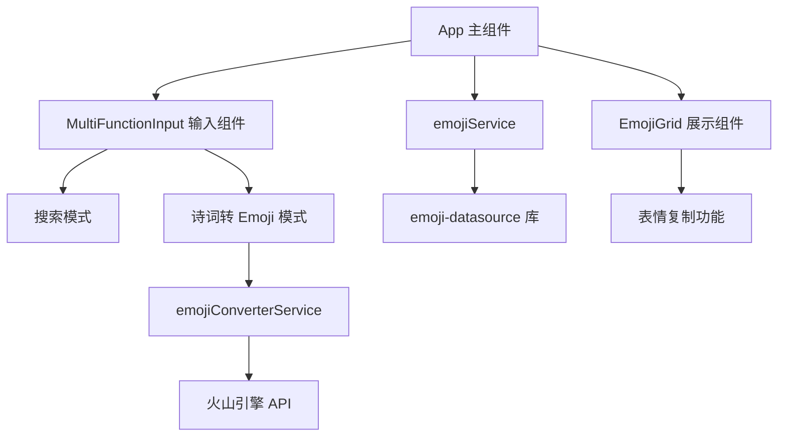

# Emoji 项目 Code Wiki

## 1. 项目概览

Emoji 是一个基于 React + TypeScript 开发的表情库应用，提供表情展示、搜索以及诗词转 Emoji 功能。

- **核心功能**：
  - Emoji 表情分类展示与搜索
  - 一键复制 Emoji 到剪贴板
  - 诗词/成语转 Emoji 功能（基于火山引擎 API）
  - API Key 配置管理

- **技术栈**：
  - React 18.2.0
  - TypeScript
  - Vite
  - Tailwind CSS
  - emoji-datasource 16.0.0

## 2. 目录结构

```
/Users/lemeng/Documents/Emoji/
├── src/
│   ├── components/          # 组件目录
│   │   ├── EmojiGrid.tsx    # Emoji 网格展示组件
│   │   ├── MultiFunctionInput.tsx  # 多功能输入组件
│   │   ├── PoetryConverter.tsx     # 诗词转换组件
│   │   └── SearchBar.tsx           # 搜索栏组件
│   ├── data/
│   │   └── emojiService.ts  # Emoji 数据处理服务
│   ├── services/
│   │   ├── aiService.ts     # AI 服务
│   │   └── emojiConverterService.ts  # 诗词转 Emoji 服务
│   ├── types/
│   │   └── emoji.ts         # Emoji 类型定义
│   ├── App.tsx              # 应用主组件
│   ├── index.css            # 全局样式
│   └── main.tsx             # 应用入口
├── public/                  # 静态资源
├── dist/                    # 构建输出
├── package.json             # 项目配置
├── tsconfig.json            # TypeScript 配置
├── vite.config.ts           # Vite 配置
└── tailwind.config.js       # Tailwind 配置
```

## 3. 系统架构与主流程

### 3.1 架构概览

该项目采用典型的 React 前端架构，组件化设计，数据流清晰。



### 3.2 主要数据流

1. **表情数据流程**：
   - `emojiService.ts` 从 `emoji-datasource` 库获取原始表情数据
   - 处理并分类表情数据，提供 `getEmojiData()` 和 `getAllEmojis()` 方法
   - `App.tsx` 调用 `getEmojiData()` 获取分类表情数据
   - `EmojiGrid.tsx` 接收并展示表情数据

2. **搜索流程**：
   - 用户在 `MultiFunctionInput` 组件输入搜索关键词
   - `App.tsx` 调用 `getAllEmojis()` 获取所有表情
   - 基于关键词过滤表情，生成搜索结果
   - `EmojiGrid.tsx` 展示搜索结果

3. **诗词转 Emoji 流程**：
   - 用户在 `MultiFunctionInput` 组件输入诗词或成语
   - 点击转换按钮，调用 `convertPoetryToEmoji()` 方法
   - `emojiConverterService.ts` 构建请求，调用火山引擎 API
   - 接收 API 返回的 Emoji 结果并展示

## 4. 核心模块与功能

### 4.1 App 主组件

**职责**：
- 管理应用状态（搜索关键词、API Key 配置）
- 协调各子组件的交互
- 处理表情数据的获取和搜索逻辑

**关键功能**：
- 从本地存储加载 API Key
- 实现表情搜索功能
- 管理 API Key 配置弹窗

**文件**：[App.tsx](file:///Users/lemeng/Documents/Emoji/src/App.tsx)

### 4.2 EmojiGrid 组件

**职责**：
- 展示表情网格（按分类或搜索结果）
- 实现表情复制功能
- 提供复制成功反馈

**关键功能**：
- 支持三种展示模式：单个分类、多个分类、搜索结果
- 点击表情复制到剪贴板
- 显示复制成功提示

**文件**：[EmojiGrid.tsx](file:///Users/lemeng/Documents/Emoji/src/components/EmojiGrid.tsx)

### 4.3 MultiFunctionInput 组件

**职责**：
- 提供搜索和诗词转 Emoji 两种模式
- 处理用户输入和模式切换
- 调用诗词转 Emoji 服务

**关键功能**：
- 模式切换（搜索/诗词转换）
- 搜索关键词输入和清除
- 诗词输入和转换
- 转换结果展示

**文件**：[MultiFunctionInput.tsx](file:///Users/lemeng/Documents/Emoji/src/components/MultiFunctionInput.tsx)

### 4.4 emojiService 服务

**职责**：
- 从 emoji-datasource 库获取表情数据
- 处理和分类表情数据
- 提供数据访问方法

**关键功能**：
- `getEmojiData()`: 获取分类表情数据
- `getAllEmojis()`: 获取所有表情（用于搜索）

**文件**：[emojiService.ts](file:///Users/lemeng/Documents/Emoji/src/data/emojiService.ts)

### 4.5 emojiConverterService 服务

**职责**：
- 调用火山引擎 API 将诗词转换为 Emoji
- 处理 API 请求和响应
- 错误处理

**关键功能**：
- `convertPoetryToEmoji()`: 将诗词转换为 Emoji
- 构建 API 请求和处理响应

**文件**：[emojiConverterService.ts](file:///Users/lemeng/Documents/Emoji/src/services/emojiConverterService.ts)

## 5. 核心 API/类/函数

### 5.1 App 组件

**函数**：`App()`
- **描述**：应用主组件，管理整体状态和布局
- **参数**：无
- **返回值**：React 组件
- **主要状态**：
  - `searchQuery`: 搜索关键词
  - `showApiKeyModal`: API Key 配置弹窗显示状态
  - `apiKeyInput`: API Key 输入值
- **主要方法**：
  - `handleSearchChange()`: 处理搜索关键词变化
  - `handleSaveApiKey()`: 保存 API Key 到本地存储

### 5.2 EmojiGrid 组件

**函数**：`EmojiGrid({ category, categories, searchResults, searchQuery })`
- **描述**：表情网格展示组件
- **参数**：
  - `category`: 单个表情分类（可选）
  - `categories`: 多个表情分类（可选）
  - `searchResults`: 搜索结果（可选）
  - `searchQuery`: 搜索关键词（可选）
- **返回值**：React 组件
- **主要方法**：
  - `handleCopy(emoji, index)`: 复制表情到剪贴板

### 5.3 MultiFunctionInput 组件

**函数**：`MultiFunctionInput({ searchQuery, onSearchChange })`
- **描述**：多功能输入组件，支持搜索和诗词转换
- **参数**：
  - `searchQuery`: 搜索关键词
  - `onSearchChange`: 搜索关键词变化回调
- **返回值**：React 组件
- **主要状态**：
  - `mode`: 输入模式（'search' 或 'poetry'）
  - `poetry`: 诗词输入内容
  - `emojiResult`: 转换结果
- **主要方法**：
  - `handleConvert()`: 转换诗词为 Emoji
  - `handleKeyDown(e)`: 处理键盘事件（回车转换）

### 5.4 emojiService 服务

**函数**：`getEmojiData()`
- **描述**：获取分类表情数据
- **参数**：无
- **返回值**：`EmojiCategory[]` 表情分类数组

**函数**：`getAllEmojis()`
- **描述**：获取所有表情（用于搜索）
- **参数**：无
- **返回值**：`EmojiItem[]` 表情数组

### 5.5 emojiConverterService 服务

**函数**：`convertPoetryToEmoji(text, apiKey)`
- **描述**：将诗词转换为 Emoji
- **参数**：
  - `text`: 诗词或成语文本
  - `apiKey`: 火山引擎 API Key
- **返回值**：`Promise<string>` 转换后的 Emoji 字符串

## 6. 数据结构

### 6.1 EmojiItem 接口

```typescript
interface EmojiItem {
  emoji: string  // Emoji 字符
  name: string   // Emoji 名称
}
```

**文件**：[emoji.ts](file:///Users/lemeng/Documents/Emoji/src/types/emoji.ts)

### 6.2 EmojiCategory 接口

```typescript
interface EmojiCategory {
  category: string     // 分类名称
  emojis: EmojiItem[]  // 分类下的表情
}
```

**文件**：[emoji.ts](file:///Users/lemeng/Documents/Emoji/src/types/emoji.ts)

## 7. 技术栈与依赖

| 依赖 | 版本 | 用途 | 来源 |
|------|------|------|------|
| react | ^18.2.0 | 前端框架 | [package.json](file:///Users/lemeng/Documents/Emoji/package.json) |
| react-dom | ^18.2.0 | React DOM 操作 | [package.json](file:///Users/lemeng/Documents/Emoji/package.json) |
| emoji-datasource | ^16.0.0 | Emoji 数据来源 | [package.json](file:///Users/lemeng/Documents/Emoji/package.json) |
| typescript | ^5.2.2 | 类型系统 | [package.json](file:///Users/lemeng/Documents/Emoji/package.json) |
| vite | ^4.5.1 | 构建工具 | [package.json](file:///Users/lemeng/Documents/Emoji/package.json) |
| tailwindcss | ^3.3.6 | CSS 框架 | [package.json](file:///Users/lemeng/Documents/Emoji/package.json) |

## 8. 配置与部署

### 8.1 本地开发

```bash
# 安装依赖
npm install

# 启动开发服务器
npm run dev

# 构建生产版本
npm run build

# 预览生产构建
npm run preview
```

### 8.2 API Key 配置

1. 点击应用右上角的设置图标
2. 在弹出的配置弹窗中输入火山引擎 API Key
3. 点击保存按钮，API Key 将存储在本地存储中

### 8.3 构建与部署

1. 运行 `npm run build` 生成生产构建
2. 构建产物位于 `dist` 目录
3. 将 `dist` 目录部署到静态网站托管服务

## 9. 功能使用指南

### 9.1 搜索 Emoji

1. 在搜索框中输入 Emoji 名称或直接输入 Emoji
2. 系统会实时显示匹配的 Emoji 结果
3. 点击 Emoji 即可复制到剪贴板

### 9.2 诗词转 Emoji

1. 切换到「诗词转 Emoji」模式
2. 输入诗词或成语，例如："花好月圆"、"忽如一夜春风来"
3. 点击「转换为 Emoji」按钮或按回车键
4. 系统会调用火山引擎 API 进行转换并显示结果

### 9.3 复制 Emoji

- 点击任意 Emoji 即可复制到剪贴板
- 复制成功后会显示绿色对勾标记和「已复制到剪贴板」提示

## 10. 常见问题与解决方案

### 10.1 API Key 配置问题

**问题**：转换诗词时提示「请配置火山引擎 API 密钥」

**解决方案**：
1. 点击右上角设置图标
2. 输入有效的火山引擎 API Key
3. 点击保存按钮

### 10.2 转换失败

**问题**：诗词转换失败

**可能原因**：
- API Key 无效或已过期
- 网络连接问题
- 火山引擎 API 服务异常

**解决方案**：
1. 检查 API Key 是否正确
2. 检查网络连接
3. 稍后重试

### 10.3 搜索无结果

**问题**：搜索 Emoji 时无结果

**解决方案**：
- 尝试使用不同的关键词
- 检查是否输入了正确的 Emoji 名称

## 11. 代码优化建议

### 11.1 性能优化

1. **表情数据缓存**：
   - 目前每次调用 `getEmojiData()` 都会重新处理数据
   - 建议添加缓存机制，避免重复计算

2. **搜索优化**：
   - 目前搜索是在前端进行全量过滤
   - 对于大量表情数据，可考虑实现防抖搜索

### 11.2 代码结构优化

1. **组件拆分**：
   - `EmojiGrid` 组件代码较长，可考虑拆分为多个子组件
   - 例如：`EmojiItem`、`EmojiCategory` 等

2. **状态管理**：
   - 对于复杂状态，可考虑使用 `useReducer` 或状态管理库

### 11.3 错误处理

1. **API 错误处理**：
   - 目前 `emojiConverterService.ts` 中的错误处理较为简单
   - 建议添加更详细的错误类型和处理逻辑

2. **用户反馈**：
   - 对于 API 调用失败，可提供更友好的用户提示

## 12. 总结

Emoji 项目是一个功能完整、界面美观的表情库应用，提供了表情展示、搜索和诗词转 Emoji 等功能。项目采用 React + TypeScript 技术栈，代码结构清晰，组件化设计合理。

通过本 Wiki 文档，您可以了解项目的整体架构、核心功能、关键 API 以及使用方法。希望这份文档能够帮助您快速理解和使用该项目。